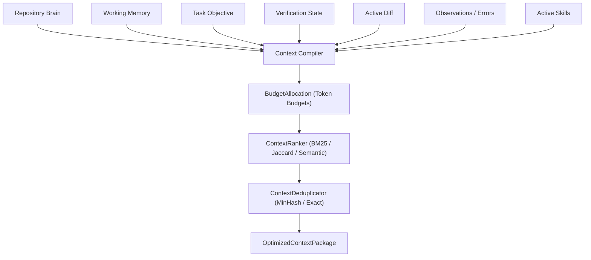

# Context Compiler & 7-Stream Pipeline Architecture

## 1. Overview

AGENTSYSTEM v2 eliminates naive prompt string concatenation in favor of an active, budget-enforced context pipeline implemented in `context/compiler.py`.

## 2. The 7 Context Streams

1. **Repository Brain**: Ingests AST symbol definitions, callers, callees, and file structures relevant to the active task.
2. **Working Memory**: Tracks current task progress, variable bindings, and inter-step findings.
3. **Task Objective**: Unambiguous, scope-restricted task instruction.
4. **Verification State**: Current stage and outcome reports from `IDEVerificationPipeline`.
5. **Diff**: Git diff of uncommitted mutations tracked by GitPython.
6. **Errors / Observations**: Deterministically parsed `Observation` instances (never raw logs).
7. **Active Skills**: Compact operational guidelines and tool rules dynamically injected by `SkillResolver`.

## 3. Strict Token Budgeting
`ContextBudgetManager` enforces hard token caps across streams (e.g. 4000 tokens for focal symbols, 2500 for diffs, 1500 for error evidence). If a stream exceeds its quota, `SkillSectionSlicer`, `RepositorySlicer`, or `ConversationSlicer` applies surgical compaction to guarantee prompts remain within model context windows without truncation faults.
