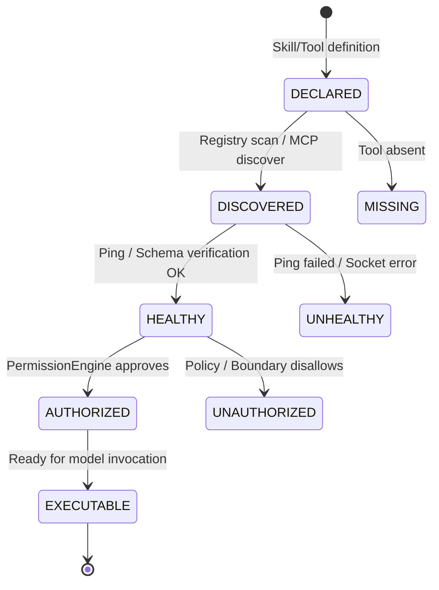

# Tool Lifecycle State Machine Architecture

## 1. Overview

To prevent exposing nonexistent, unverified, or broken tools to LLM models, AGENTSYSTEM v2 introduces the strict `ToolLifecycleState` machine in `runtime/tool_state_machine.py`.

## 2. States & Invariants

| State | Definition | Exposed in LLM Tool Schemas? |
| :--- | :--- | :---: |
| `DECLARED` | Specified in a skill manifest or capability definition. | **NO** |
| `DISCOVERED` | Located in built-in registry or active MCP server list. | **NO** |
| `HEALTHY` | Passed schema validation and liveliness/connectivity ping. | **NO** |
| `AUTHORIZED` | Approved by `PermissionEngine` against active task capabilities. | **NO** |
| `EXECUTABLE` | All prerequisites verified; tool is completely ready. | **YES** |
| `MISSING` | Required tool was not found in any registered catalog. | **NO** |
| `UNHEALTHY` | Connection refused, timeout, or invalid tool schema. | **NO** |
| `UNAUTHORIZED` | Exceeds task boundaries or forbidden by security policy. | **NO** |

## 3. Enforcement Guarantee
`CapabilityRouter.get_tool_schemas_for_task` inspects `ToolStateMachine` for each candidate tool. Any tool whose state is not strictly `EXECUTABLE` is filtered out. The LLM model is never prompted with tools that cannot execute.
