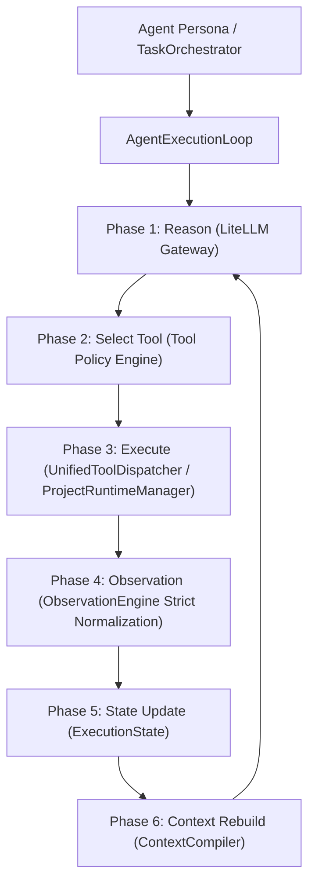

# Unified Runtime Architecture

## 1. Architectural Mandate

AGENTSYSTEM v2 unifies all agent personas (`BaseAgent`, `CoderAgent`, `TesterAgent`, `ReviewerAgent`, `PlannerAgent`, `SpecificationAgent`, `ArchitectureAgent`, `DynamicAgent`) and orchestrator execution routines onto a single authoritative execution engine: **`AgentExecutionLoop`**.

## 2. The 7-Phase State Machine

Every reasoning cycle follows strict invariants:

1. **Reason**: Queries the LiteLLM Gateway using standardized methods (`chat_with_tools` when OpenAI tool schemas exist, `chat` otherwise). Prompt is compiled from the latest rebuilt context package.
2. **Select Tool**: Evaluates requested tool against the scoped `ToolPolicy`. Ensures tool is authorized and currently in `EXECUTABLE` lifecycle state.
3. **Execute**: Dispatches tool call via `UnifiedToolDispatcher`. Long-running dev servers (`npm run dev`, `vite`, `uvicorn`, etc.) are automatically intercepted and monitored via `ProjectRuntimeManager`.
4. **Observation**: Normalizes raw outputs into structured `Observation` records. Raw log dumps are NEVER appended into context or prompts.
5. **State Update**: Updates `ExecutionState` with step observations, reasoning traces, and file mutations.
6. **Context Rebuild**: Ingests new structured observations, diffs, and working memory into `ContextCompiler` to dynamically re-synthesize prompt packages within strict token budgets.
7. **Reason Again**: The loop advances to Phase 1 with the freshly compiled context until task completion or terminal state.

## 3. Backward Compatibility
* Legacy callers invoking `ReActAgentLoop` or `ReActLoop` receive backward-compatible behavior through delegation to the unified runtime state machine.
* `ProductionIDE` operates as a high-level developer facade integrating `AgentExecutionLoop`, `IDEVerificationPipeline`, and `IDERepairPipeline`.
